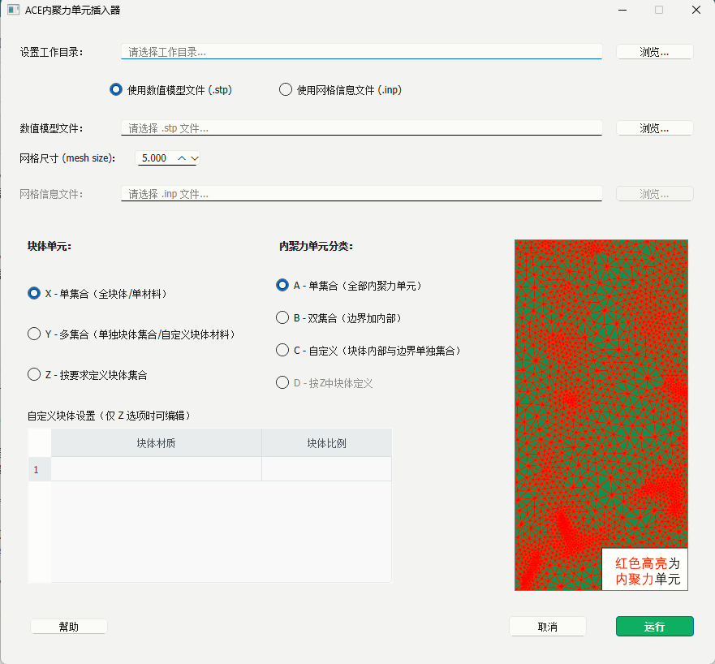

  <h1>🚀 ACE</h1>

  

    <strong>简介</strong> 
    <em>一款Abaqus 二维零厚度内聚力单元插入插件</em>
  

  

   

 

## 💻 图形界面

  

 

## 📚 使用方法
本插件专为 Abaqus 2022 版本设计，支持快速插入二维零厚度内聚力单元（COH2D4）。

**快速上手步骤：**

1. **安装插件**  
   把整个 `ACE` 文件夹放到 Abaqus 的 `plugins` 目录下（通常是 `C:\SIMULIA\CAE\plugins` 或类似路径）。

2. **启动插件**  
   打开 Abaqus/CAE → 菜单栏 **Plug-ins** → **ACE**

3. **操作流程**  
   - 选择模型 / Part  
   - 选择插入位置
   - 一键生成Part

**注意事项：**
- 支持批量插入多条裂纹路径
- 更多注意事项请见目录中"ACE插件使用说明.pdf"

## ❓ 常见问题（FAQ）

在使用 ACE 插件插入二维零厚度内聚力单元时，可能会遇到以下常见问题。下面列出解决方案，欢迎补充你的经验！

- 1、运行时提示“get”系列错误。
- 请检查选择的inp文件是否按照说明书所说的对内聚力插入边界进行分组。

- 2、运行等待时间过长。
- 因为插件使用的方法是删除单元并重建单元的思路，所以Abaqus会不断重构模型导致运行时间较长，我们也意识到了本问题，
- 可以通过无GUI的方式使用插件代码对模型进行添加，速度会显著提升。

## 🚀 运行示例

 <em>图 1：边界插入内聚力单元示例1</em>

  

 <em>图 2：边界插入内聚力单元示例2</em>

  

 <em>图 3：全内部网格边界插入内聚力单元示例</em>

  

## 🌟 软件前瞻

正在全力开发中的 **ACE内聚力单元插入器**（暂定名）———下一代 Abaqus 裂纹模拟利器：  
**一句话介绍**：一款支持2D全自动零厚度内聚力单元插入软件，一键导入模型，确定网格划分密度，选定不同内聚力单元插入模式，一键即可获得Abaqus内聚力模型

### 新版 GUI 预览（开发截图）

  
<em>图 1：ACE内聚力单元插入器主界面（开发中）</em>

  <em>ACE内聚力单元插入器 预计 2026 年底 公测，欢迎关注仓库动态或本项目获取第一时间更新！</em>

## 📬 开发者联系方式

欢迎反馈问题、提出建议、合作讨论或报告 bug！  
作者会尽量及时回复～

- **邮箱**：asd1255244@163.com
- **电话 / 微信**：17636628874（微信同号）

感谢你的支持与 Star！✨  
期待 ACE（以及未来的 ACE内聚力单元插入器）能帮到你的模拟工作～
